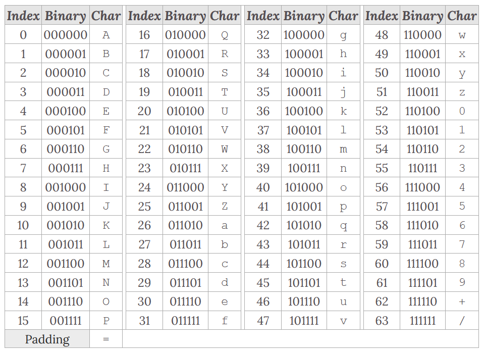

# What is Base64?
Base64 is one of the most popular forms of encoding (re-representing) data.  
It uses 64 characters, including the upper & lower cases of the English alphabet, decimals 0-9, and special characters "+", "/", and "="  

#### Example Base64
`YW55IGNhcm5hbCBwbGVhc3VyZQ==`

# How does it work?
Base64 works by mapping a character to a binary equivalent.  
There is one small item to be aware of with base64 encoding, if an output is not divisible by 8-bit octets, then it will be "padded" using '='. 

# Tools
* [Cyber Chef](https://gchq.github.io/CyberChef/)
* [Base64 Guru](https://base64.guru/)
