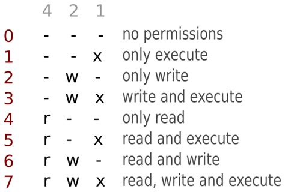

#  What is Octal?
The Octal Number System is a type of Number Representation techniques, that only uses 8 possible digit values (0, 1, 2, 3, 4, 5, 6, 7)

#### Example of Octal

# How does it work?
Each Octal number can be represented using only 3 bits, with each group of bits having a distinct value between 000 (for 0) and 111 (for 7 = 4+2+1). The equivalent binary number of Octal number are as given below −
| Octal Digit Value | Binary Equivalent |
|:-----------------:|:-----------------:|
|         0         |        000        |
|         1         |        001        |
|         2         |        010        |
|         3         |        011        |
|         4         |        100        |
|         5         |        101        |
|         6         |        110        |
|         7         |        111        |

# Tools
* [Cyber Chef](https://gchq.github.io/CyberChef/)
* [Tutorials Point](https://www.tutorialspoint.com/octal-number-system)